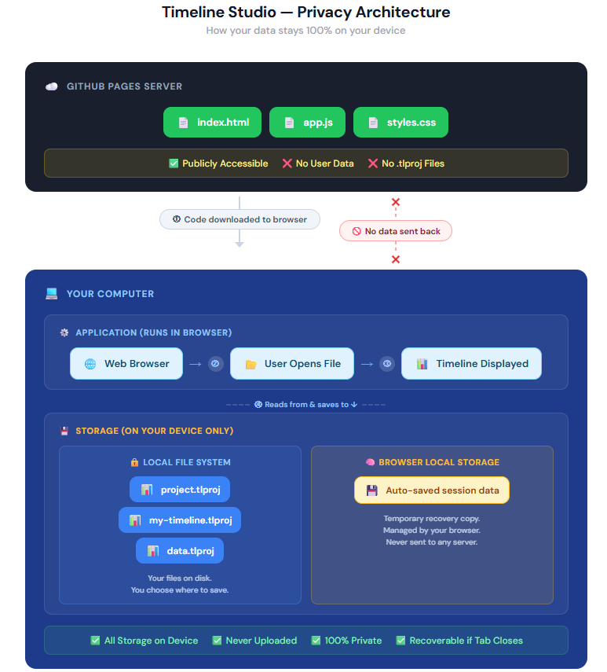

# Your Data Stays on Your Device

**Timeline Studio** is designed so that your project files never leave your computer. This isn't a policy decision — it's how the app is built. There is no server, no database, and no mechanism for your data to be collected, even accidentally.

**App link:** [https://adrotar21.github.io/timeline-studio/](https://adrotar21.github.io/timeline-studio/)

---

## How It Works

### 1. You open the link

When you visit the app URL, your browser downloads three files from **GitHub Pages** (a static hosting service run by GitHub/Microsoft): `index.html`, `app.js`, and `styles.css`. That's it. GitHub Pages can only serve files — it cannot run server-side code, accept uploads, or store anything you send it.

### 2. The app runs in your browser

Once those three files download, the app is running entirely on your machine. Think of it like downloading a calculator — after that point, the server has no involvement. Everything you see and do happens inside your browser.

### 3. You open a project file

When you click **File > Open** and select a `.tlproj` file, your browser reads it directly from your hard drive using its built-in [File API](https://developer.mozilla.org/en-US/docs/Web/API/File_API). The file goes from your disk into browser memory — no upload, no network request, nothing leaves your machine. You can verify this yourself by watching the Network tab in Developer Tools (F12) while you work.

### 4. Auto-save stays local too

Timeline Studio saves your work automatically to your browser's **Local Storage** — a private storage area on your device that browsers provide to websites. If you close the tab or your browser crashes, your work is waiting for you when you come back.

Local Storage is managed entirely by your browser. It never gets sent to any server, other websites can't access it, and you can clear it anytime through your browser settings. When you use **File > Save**, the app writes a `.tlproj` file to whatever location you choose on disk.

---

## Why Your Data Can't Leak

This isn't about trust — the architecture makes data collection structurally impossible:

| | |
|---|---|
| **No backend** | GitHub Pages is static-only. There is no server-side code to receive or process data. |
| **No database** | There is nowhere to store user data, even if it were somehow sent. |
| **No outgoing requests** | The app never sends your file contents over the network. Zero `fetch()` calls, zero uploads. |
| **Browser sandboxing** | Your browser only allows the app to read files you explicitly select. The File API is read-only and user-initiated. |
| **Local Storage is local** | Auto-saved session data lives on your device, scoped to your browser. No server can access it. |
| **No tracking** | No analytics, no cookies, no third-party scripts. |

---

## Verify It Yourself

1. Open the app in Chrome or Edge
2. Press **F12** to open Developer Tools
3. Go to the **Network** tab
4. Open a `.tlproj` file and make some edits
5. Watch the network activity — you'll see nothing sent out

To inspect auto-saved data: **F12 > Application tab > Local Storage** > `https://adrotar21.github.io`. Your session data is right there on your machine.

The full source code is also public in the [GitHub repository](https://github.com/adrotar21/timeline-studio).

---

## A Simple Analogy

Think of a PDF reader. When you open a PDF, the reader displays it on your screen — the file doesn't get sent to Adobe. If the reader has crash recovery, it saves a temp copy to your hard drive, but that stays local too.

Timeline Studio works the same way. Instead of installing software, your browser becomes the app the moment you visit the link. Your `.tlproj` files are like those PDFs — opened locally, rendered locally, saved locally, never uploaded.

---

## References

**GitHub Pages (static hosting only)**
- [What is GitHub Pages?](https://docs.github.com/en/pages/getting-started-with-github-pages/what-is-github-pages) — GitHub Docs
  > "GitHub Pages is a static site hosting service that takes HTML, CSS, and JavaScript files straight from a repository on GitHub, optionally runs the files through a build process, and publishes a website."
- [Creating a GitHub Pages site](https://docs.github.com/en/pages/getting-started-with-github-pages/creating-a-github-pages-site) — GitHub Docs
  > "GitHub Pages does not support server-side languages such as PHP, Ruby, or Python."

**Browser File API (local file reading)**
- [File API](https://developer.mozilla.org/en-US/docs/Web/API/File_API) — MDN Web Docs
  > "The File API enables web applications to access files and their contents."

**Local Storage (device-only persistence)**
- [Web Storage API](https://developer.mozilla.org/en-US/docs/Web/API/Web_Storage_API) — MDN Web Docs
- [Window: localStorage](https://developer.mozilla.org/en-US/docs/Web/API/Window/localStorage) — MDN Web Docs
  > "localStorage is similar to sessionStorage, except that while localStorage data has no expiration time, sessionStorage data gets cleared when the page session ends — that is, when the page is closed."
