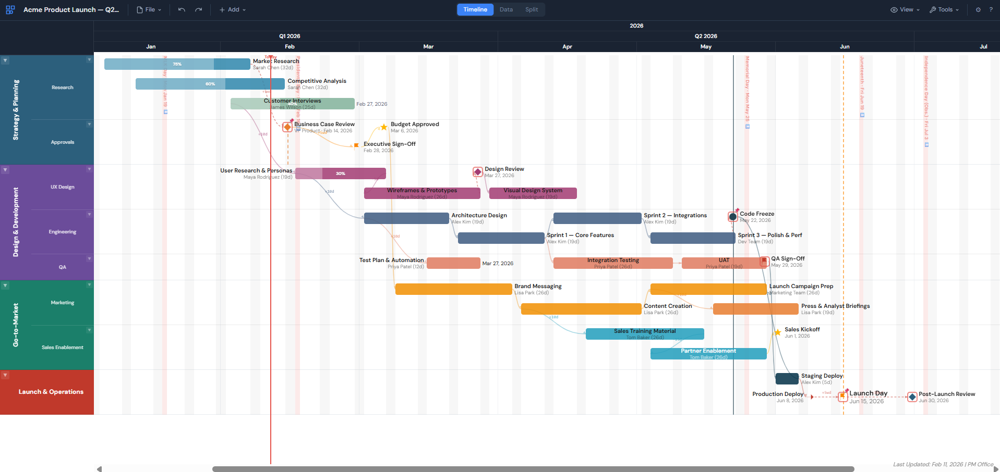
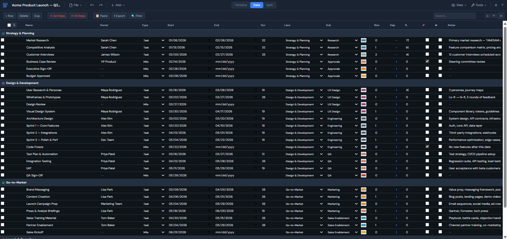
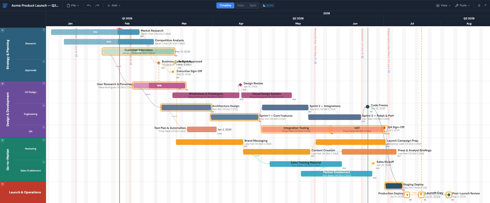
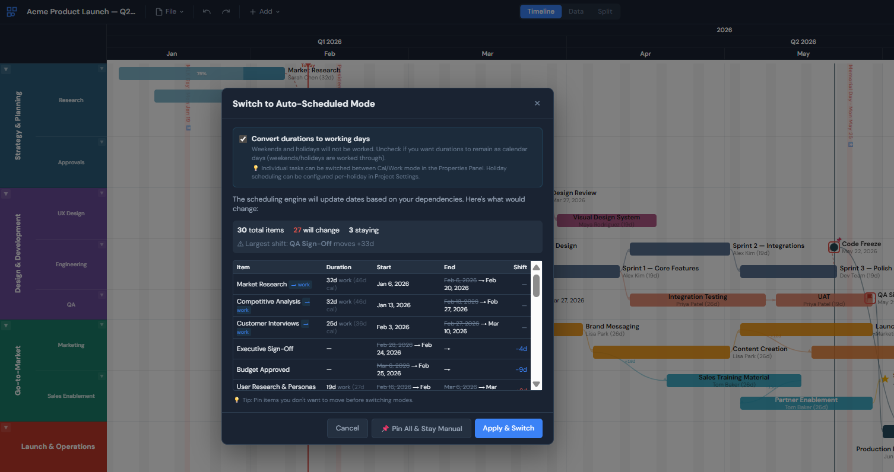
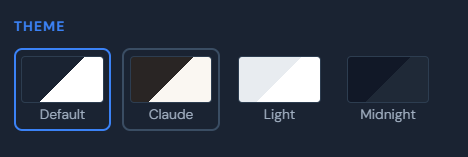

# Timeline Studio

**A cross-platform, zero-dependency Gantt chart tool for project managers.**
Download three files. Open `index.html`. Done.


[**Try it in your browser**](https://adrotar21.github.io/timeline-studio/) -- no download required



---

## Why Timeline Studio?

- **Built for PMs** who need clean, readable timelines with 30-50 items for leadership reviews
- **Three files, zero dependencies** -- works on locked-down corporate machines without admin rights
- **Cross-platform** -- Windows, Mac, Linux, any modern browser
- **No install, no server, no npm, no build step** -- just open a file
- **Shareable** -- send via email, USB drive, or file share
- **Free and open source**

### Where it fits

Timeline Studio lives in the same space as Office Timeline Pro (~$149/yr), but works cross-platform and doesn't require PowerPoint, plugins, or a license. Compared to open source options like Frappe Gantt (a library with no swimlanes or scheduling engine), it offers a more complete feature set out of the box -- dependencies, auto-scheduling, multiple export formats, and a built-in data table. And unlike heavyweight tools like MS Project or Smartsheet, it's designed for the PM who needs a clean timeline for a leadership review, not an enterprise resource planner.

---

## Quick Start

1. **Download** `index.html`, `styles.css`, and `app.js` from this repo
2. **Open** `index.html` in Chrome, Edge, Firefox, or Safari
3. **Start building** -- choose a template (Product Launch, Software Development) or start blank

That's it. No terminal. No package manager. No account.

> **Session recovery:** Your work is automatically saved to your browser's local storage, so if you accidentally close the tab you won't lose anything. Use **File > Save** to write a `.tlproj` file to disk -- once you've saved, re-saving overwrites the same file. You choose the location.

> **Fonts:** The app loads [DM Sans](https://fonts.google.com/specimen/DM+Sans) and [JetBrains Mono](https://fonts.google.com/specimen/JetBrains+Mono) from Google Fonts for best appearance, but works fine offline with system font fallback.

> **Privacy:** Your project files never leave your device. There is no server, no database, and no tracking — the app runs entirely in your browser. See [`PRIVACY.md`](PRIVACY.md) for a full explanation of the architecture and sourced references.

---

## Features

### Timeline View

Milestones and tasks on a zoomable, scrollable timeline. Drag items to change dates or reorder. Swimlanes organize work into horizontal sections with optional sub-swimlanes.

- **Swimlanes** with 3-state collapse (expanded / minimized / hidden) and sub-swimlanes
- **Drag-and-drop** items left/right (dates) or up/down (rows), with arrow-key nudging
- **Zoom** from 10% to 300%, fit-to-content auto-zoom, configurable timescale (Weeks/Months/Quarters/Years)
- **Visual aids** -- today marker, weekend shading, holiday shading, watermark stamp
- **7 milestone icon shapes**, 20 preset colors, progress bars on tasks


### Data View

A spreadsheet-style table for fast editing, filtering, and bulk operations. Switch between Timeline, Data, and Split views at any time.

- **Inline editing** for all item properties -- dates, names, owners, colors, notes
- **Column filters** for name, owner, notes, and date ranges with active-filter indicators
- **Advanced search** with regex support and match navigation
- **Paste from Excel** -- tab-separated import (`Name [Tab] Date` for milestones, `Name [Tab] Start [Tab] End` for tasks)
- **CSV export** with predecessor formatting



### Dependencies & Scheduling

A full dependency engine with three link types, lag support, and two scheduling modes.

- **Link types:** Finish-Start (FS), Start-Start (SS), Finish-Finish (FF) with positive or negative lag
- **Manual mode** -- you control all dates; propagate changes on demand with Ctrl+Shift+P
- **Auto-Scheduled mode** -- dates auto-calculate from dependencies and durations
- **Critical path** highlighting shows zero-float items in your dependency chain
- **Float labels** display each item's scheduling flexibility (View > Show Float)
- **Pin dates** to protect individual items from propagation or auto-scheduling
- **Cycle detection** prevents circular dependency chains



### Auto-Scheduling

Start by laying out your timeline manually -- drag items where they make sense, set dates visually. When you're ready for more structure, switch to Auto-Scheduled mode and Timeline Studio transforms your project into a fully-functioning schedule with dependency-driven placement, working day calculations, and automatic conflict resolution.

- **One-click conversion** from manual to auto-scheduled mode with a preview of every item that will move
- **Working day conversion** -- automatically converts calendar durations to working days, skipping weekends and holidays
- **Dependency-driven dates** -- items reposition based on their dependency chain, lag values, and link types
- **Pin protection** -- pinned items stay exactly where you put them during conversion



### Export & Screenshots

Multiple output formats for sharing timelines with stakeholders.

- **SVG** -- scalable vector, preserves text and theme colors
- **PNG** -- high-DPI raster (3x device pixel ratio), pixel-perfect
- **CSV** -- data table with all properties including predecessors
- **JSON** -- full project file (`.tlproj`)
- **Clipboard screenshots** -- copy viewport or full timeline to clipboard instantly
- **Watermark** -- configurable "Last Updated" date stamp with position and optional project owner
- **Fit-to-content** auto-crops exports to show all items with no wasted space

### Themes

Four built-in themes. Switch instantly from Settings.



### More Features

- **Keyboard shortcuts** for power users (see table below)
- **Lasso selection** and bulk operations (color, owner, visibility, dependencies)
- **40-level undo/redo** with full project snapshots
- **Session recovery** via browser local storage
- **Holiday management** with per-holiday scheduling control and Excel paste import
- **Lock mode** to prevent accidental item movement
- **Hide mode** to toggle visibility of marked items
- **Right-click context menus** throughout (link dependencies, propagate, auto-arrange, label position)
- **Custom date formats** (6 presets + custom pattern)
- **Time-to-Target** countdown labels to a target milestone
- **Project templates** -- Product Launch, Software Development, or duplicate current

---

## File Format

Timeline Studio uses `.tlproj` files -- human-readable JSON with a version field for backward-compatible migration.

```json
{
  "version": 2,
  "name": "Q1 Product Launch",
  "owner": "Jane Smith",
  "dateFormat": "MMM D, YYYY",
  "schedulingMode": "manual",
  "swimlanes": [ ... ],
  "items": [ ... ]
}
```

Files are diffable, version-controllable, and can be programmatically generated. Open any `.tlproj` file with a text editor to inspect or modify it directly.

---

## Project Structure

The entire application is three files. This is a deliberate architectural constraint -- it makes the tool trivially portable and shareable.

```
index.html          # UI structure and modals
styles.css          # Theming via CSS custom properties
app.js              # All application logic (~2,600 lines)
Showcase.tlproj     # Example project file
tests/              # Test suites (not required to run the app)
screenshots/        # README images
```

---

## Keyboard Shortcuts

| Shortcut | Action | Shortcut | Action |
|----------|--------|----------|--------|
| `Ctrl+S` | Save | `Ctrl+Shift+S` | Save As |
| `Ctrl+Z` | Undo | `Ctrl+Y` | Redo |
| `Ctrl+N` | New Project | `Ctrl+O` | Open File |
| `Ctrl+A` | Select All | `Delete` | Delete selected |
| `Ctrl+Shift+F` | Fit to Content | `Alt+1` | Fit to Content (alt) |
| `Ctrl+Shift+P` | Propagate | `Escape` | Deselect / close |
| `Arrow keys` | Nudge items | `Ctrl+Arrows` | Nudge faster (7d) |
| `Ctrl+Click` | Multi-select | `Alt+Drag` | Lasso select |
| `Ctrl+Scroll` | Zoom (5% steps) | `Ctrl+Shift+Scroll` | Fine zoom (1% steps) |

See the in-app **Help** (?) for the full list, tips, and troubleshooting.

---

## Browser Compatibility

| Browser | Support | Notes |
|---------|---------|-------|
| **Chrome / Edge** | Recommended | Full File System Access API -- native save/open dialogs |
| **Firefox** | Supported | Uses download fallback for save |
| **Safari** | Supported | Uses download fallback for save |

Requires a modern browser with ES6+, CSS custom properties, and Canvas API support. The app loads Google Fonts from CDN but works fully offline with system font fallback.

---

## Development

No build step. Edit the three files directly and refresh your browser.

**Run tests** (Node.js CLI, zero dependencies):

```bash
node tests/test_comprehensive.js   # 115 tests
node tests/test_expanded.js        # 464 tests
```

**Tech stack:** Vanilla JavaScript (ES6+), SVG for dependency arrows, Canvas API for PNG export with DPI scaling, CSS custom properties for theming, localStorage for session recovery.

See [`CLAUDE.md`](CLAUDE.md) for full architecture documentation including the rendering pipeline, coordinate system, export mechanics, and dependency engine internals.

---

## Roadmap

Timeline Studio is currently in beta. We're looking for users and feedback to help shape the 1.0 release.

If you find it useful, have suggestions, or run into issues, please [open an issue](../../issues) or start a [discussion](../../discussions).

See [`BACKLOG.md`](BACKLOG.md) for the detailed feature and bug backlog.

---

## License

*License TBD -- to be determined before public release.*

---

## Acknowledgments

- [DM Sans](https://fonts.google.com/specimen/DM+Sans) and [JetBrains Mono](https://fonts.google.com/specimen/JetBrains+Mono) fonts via Google Fonts
- Built with vanilla JavaScript -- no frameworks, no dependencies, no compromises
